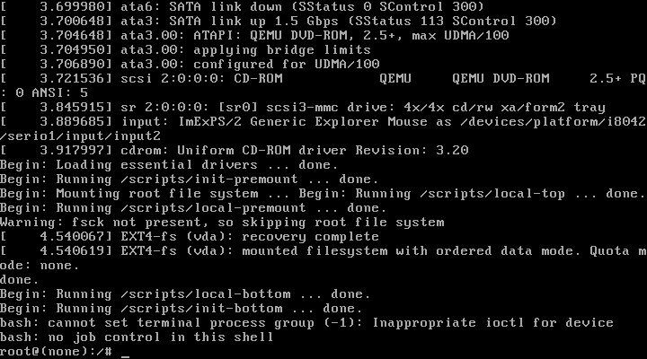

# Ecosistema de exploits gen5w — Cadena de descifrado y persistencia

Fuente: repositorio público `gitlab.com/g4933/gen5w` (grupo `gen5w`, alias `hkm-gen5`).  
Fecha de análisis: 2026-06-30.

---

## Contexto

El head unit **Standard Gen5W Navigation** (plataforma **mango/S5W**), presente en Kia Rio MY22 y otros modelos Hyundai/Kia, cifra todo el paquete OTA con AES. El grupo gen5w ha desarrollado una cadena completa de herramientas para:

1. Obtener ejecución de código arbitrario en el HU vía USB.
2. Extraer las claves de descifrado del dispositivo físico.
3. Descifrar los archivos OTA en el PC.
4. Parchear el rootfs y mantener la modificación tras actualizaciones oficiales.

---

## Proyectos del grupo (gitlab.com/g4933/gen5w)

| Repositorio | Descripción |
|---|---|
| `navi_extended` | Exploit — reemplaza AppNavi para obtener ejecución shell desde USB |
| `update_decryptor` | Descifrador Docker — usa claves extraídas del HU |
| `update-patcher` | Parchador — mantiene persistencia tras OTA; desactiva cifrado en AppUpgrade |
| `update_fetcher` | CLI para descargar actualizaciones oficiales del servidor Hyundai/Kia |
| `gen5w-docker` | Entorno Docker para ejecutar binarios mango en chroot |
| `navi-updates-lfs` | Almacén Git LFS de actualizaciones descifradas/parcheadas |

---

## Herramienta 1: `navi_extended` — Exploit de entrada

### Mecanismo

`navi_extended` es una aplicación que reemplaza temporalmente a `AppNavi` (la app de navegación oficial). Al colocarla en `/Bin` del HU, se lanza en lugar de AppNavi y ejecuta un script shell llamado `main_loop.sh` desde la raíz de la unidad USB conectada.

### Requisitos previos

- HU con sistema de navegación **no parcheado** (versión antigua o sin la modificación gen5w).
- USB formateado en **exFAT**.
- Archivos OTA oficiales en el USB.
- Acceso al **Engineering Mode** del HU.

### Proceso

1. Instalar `navi_extended` como sustituto de AppNavi.
2. Crear `main_loop.sh` en la raíz del USB (el script a ejecutar).
3. Conectar USB al vehículo → `main_loop.sh` se ejecuta automáticamente.
4. El script extrae del HU:
   - **`DecryptToPIPE`** — binario de descifrado del HU.
   - **`decryption_key.der`** — clave privada de descifrado.
5. Ambos archivos deben **conservarse** para futuros descifrados y actualizaciones.

> Los autores declaran explícitamente que NO proporcionan estos archivos — deben obtenerse del HU físico.

---

## Herramienta 2: `update_decryptor` — Descifrado en PC

### Qué hace

Imagen Docker que utiliza `DecryptToPIPE` + `decryption_key.der` (extraídos del HU) para descifrar los archivos OTA en el PC.

### Uso

```bash
# Clonar y construir
git clone https://gitlab.com/g4933/gen5w/update_decryptor
cd update_decryptor
docker build -t gen5wdecryptor ./

# Ejecutar en el directorio que contiene los archivos OTA + DecryptToPIPE + decryption_key.der
docker run --rm -it -v $PWD:/mnt gen5wdecryptor
```

**Resultado:** directorio `decrypted/` con todos los archivos que estaban cifrados en formato estándar.

---

## Herramienta 3: `update-patcher` — Persistencia post-OTA

### Qué hace

Una vez que el HU tiene actualizaciones desencriptadas habilitadas, este patcher modifica `mango-rootfs.tar.gz` para mantener la modificación después de una actualización oficial.

### Mecanismo clave

El archivo `/update/disableEncryptionUpdate` activa en el HU el modo de aceptar actualizaciones **sin cifrado** (vía `AppUpgrade`). Esto permite instalar versiones parcheadas del rootfs.

### Script `disable_encryption.sh` → `main_loop.sh`

```bash
USB_PATH=$(dirname $0)
cd $USB_PATH
touch /update/disableEncryptionUpdate   # crea el flag en el HU
sleep 10
```

### Flujo de uso

```bash
# Requiere mango-rootfs.tar.gz descifrado en /update
docker compose build
docker compose up
# Salida: /update/output/mango-rootfs.tar.gz (parcheado)
```

### Formato tar usado

Los paquetes se crean en formato **ustar** con ownership numérico (uid/gid).

---

## Herramienta 4: `update_fetcher` — Descarga de actualizaciones oficiales

CLI para obtener actualizaciones desde los servidores oficiales de Hyundai/Kia:

```bash
./UpdateFetcher list --region {REGION}
./UpdateFetcher inf --region {REGION} --model {MODEL}
./UpdateFetcher download --inf {PATH_TO_INF_FILE}
```

Descarga archivos `.tar.gz` e `.inf` de configuración. No documenta las URLs/endpoints (probablemente hardcodeadas en el binario).

---

## Herramienta 5: `gen5w-docker` — Entorno de desarrollo mango

Docker para ejecutar binarios del HU en PC:

```bash
docker compose build
docker compose run mango          # shell en el contenedor
docker compose run mango /chroot.sh  # chroot completo
```

- Requiere `mango-rootfs.tar.gz` **descifrado** (o carpeta `mango-rootfs/` ya extraída).
- Cambios en `/mango` dentro del contenedor persisten fuera (bind mount).
- Estado actual: **pre-alpha** — no hay Qt/GPU simulados, las apps de navegación no funcionan.

---

## Flujo completo de RE

```
HU físico
    │
    ▼ navi_extended (exploit USB)
    │
    ├── DecryptToPIPE  ──┐
    └── decryption_key.der ──┘
                         │
                         ▼ update_decryptor (Docker en PC)
                         │
                         └── decrypted/
                              ├── mango-rootfs.tar.gz  ──► gen5w-docker (chroot)
                              ├── update.tar.gz
                              ├── appnavi.tar
                              ├── iasImage*
                              └── ...
                                   │
                                   ▼ update-patcher (Docker en PC)
                                   │
                                   └── mango-rootfs.tar.gz (parcheado)
                                        │
                                        ▼ update-patcher instala vía /update/disableEncryptionUpdate
                                        └── HU permanentemente modificado
```

---

## Implicaciones para este proyecto

| Hallazgo anterior | Estado actualizado |
|---|---|
| "Cifrado AES, clave probablemente en rootfs" | ✅ Confirmado — `DecryptToPIPE` es el binario de descifrado del HU |
| "Sin rootfs descifrado, no hay acceso a binarios OTA" | ✅ Hay ruta conocida: exploit gen5w con HU físico |
| "Buscar `update_agent` en rootfs" | ✅ El binario relevante es `DecryptToPIPE` (en `/Bin` o similar del HU) |
| "Estrategia: analizar instalador OTA" | ✅ El instalador es `AppNavi`/`navi_extended` — ya hay RE del flujo completo |

### Requisito crítico

**Se necesita acceso físico al HU** (instalado en el vehículo o en banco de pruebas) para ejecutar el exploit y extraer las claves. Sin `DecryptToPIPE` + `decryption_key.der`, los archivos OTA permanecen cifrados.

---

## Referencias

- `gitlab.com/g4933/gen5w/navi_extended`
- `gitlab.com/g4933/gen5w/update_decryptor`
- `gitlab.com/g4933/gen5w/update-patcher`
- `gitlab.com/g4933/gen5w/update_fetcher`
- `gitlab.com/g4933/gen5w/gen5w-docker`

---

## Validación práctica del pipeline (dry-run sin HU físico)

Fecha: 2026-07-11. Objetivo: responder "¿existe un emulador para el firmware?" — no existe un emulador de hardware completo, pero **sí se puede validar mecánicamente todo el pipeline Docker (`update_decryptor` → `update-patcher` → `gen5w-docker`) con datos sintéticos**, sin necesidad de acceso físico al HU ni de las claves reales. Esto permite depurar los scripts y detectar bugs de documentación/mecánica antes de gastar el único intento disponible en el vehículo real.

### Qué se probó

Las tres imágenes Docker de `tools/` (`update_decryptor`, `update-patcher`, `gen5w-docker`) se construyeron y ejecutaron localmente (macOS Apple Silicon) contra datos ficticios:

1. **`update_decryptor`**: se sustituyó el placeholder `DecryptToPIPE` por un script stub (pass-through + marcador) y `decryption_key.der` por una clave dummy, se reconstruyó la imagen y se ejecutó `entrypoint.sh` contra archivos OTA falsos. **Funcionó correctamente** — recorre el árbol de `/mnt`, invoca el binario de descifrado por cada fichero y reconstruye la jerarquía en `decrypted/`.
2. **`update-patcher`**: se generó un `mango-rootfs.tar.gz` sintético con QML de Engineering Mode y `dropbearmulti` de prueba. `update_patcher.sh` se ejecutó de punta a punta: **los tres parches (Engineering Mode, `checkSOPVersion()`, symlink `dropbear`) se aplicaron correctamente**, verificado extrayendo el `mango-rootfs.tar.gz` de salida.
3. **`gen5w-docker`**: `chroot.sh` monta `/proc`, `/sys`, `/dev`, `/dev/pts` y ejecuta `chroot` correctamente contra un rootfs sintético (sin userland real) — el fallo observado (`bash: No such file or directory`) es el esperado por la ausencia de binarios reales, no un error de montaje/privilegios. Confirma que la mecánica del contenedor (montajes + `chroot()`) funciona en este entorno.

### Bug de documentación encontrado y corregido

`tools/README.md` (Fase 2.2) indicaba montar `-v $PWD/keys:/DecryptToPIPE_dir` en runtime. **Esa ruta no se usa en ningún sitio** — `entrypoint.sh` busca `/DecryptToPIPE` y `/decryption_key.der` en la raíz del contenedor, y el `Dockerfile` los incrusta en la imagen vía `COPY ./ /` **en tiempo de build**. El procedimiento correcto es reemplazar los placeholders del repo (`update_decryptor/DecryptToPIPE`, `update_decryptor/decryption_key.der`) por los archivos reales extraídos del HU **antes de `docker build`**, no montarlos como volumen. Corregido en `tools/README.md`.

### Trampa práctica en `update-patcher`

`update_patcher.sh` asume que `mango-rootfs.tar.gz` tiene las rutas en la raíz del tar (`./app/share/...`), **sin** directorio contenedor. Empaquetar el tar con `tar -czf mango-rootfs.tar.gz mango-rootfs/` (incluyendo el nombre de carpeta como prefijo) rompe todos los `cd ./app/share/` posteriores con `No such file or directory` silencioso (el script no aborta, solo deja de aplicar los parches). Confirma la advertencia que ya llevaba el propio script en el comentario de la línea 47 — documentado aquí porque es un error fácil de cometer al reempaquetar manualmente el rootfs real.

### Confirmación de arquitectura x86_64 real

Al construir/ejecutar en un Mac Apple Silicon (ARM64), Docker avisa: `WARNING: the requested image's platform (linux/amd64) does not match the detected host platform (linux/arm64/v8)` — y aun así ejecuta correctamente. Docker Desktop en Apple Silicon emula x86_64 automáticamente (Rosetta/QEMU internos). Esto es relevante para el día que se disponga del `DecryptToPIPE` real (ELF x86_64 real del HU): correrá igual bajo esa emulación, sin pasos adicionales.

### Qué sigue bloqueado

Nada de esto ejecuta binarios reales del HU ni descifra contenido real — sigue haciendo falta:
- `DecryptToPIPE` real (ELF x86_64 del HU) + `decryption_key.der` real, obtenibles únicamente vía el exploit `navi_extended` con acceso físico al vehículo.
- Un `mango-rootfs.tar.gz` real descifrado para que `gen5w-docker` chroot a un userland de verdad (glibc, `bash`, Qt, etc.) en vez de fallar por binarios ausentes.

> **Corrección (2026-07-11):** el párrafo original aquí descartaba un QEMU system-mode completo por poco rentable frente al chroot. Tras probarlo con datos sintéticos (ver sección siguiente), esa conclusión era prematura — sí aporta algo que el chroot no puede dar (arranque real de systemd + framebuffer real vía `virtio-gpu`), y el coste de montarlo resultó bajo. Ver [`tools/gen5w-qemu/`](../tools/gen5w-qemu/).

---

## Virtualización completa con QEMU — alternativa/complemento al chroot (2026-07-11)

`gen5w-docker` (chroot) comparte el kernel del host: no hay arranque real de systemd ni salida
gráfica Qt/GPU (limitación que el propio proyecto documenta). Se evaluó si un QEMU en **modo sistema
completo** (kernel propio del guest, no compartido con el host) cierra ese hueco, aceptando que los
periféricos específicamente automotrices (CAN, pantalla táctil real, DAB) no van a funcionar — que es
justo lo que no hace falta para inspeccionar binarios, arranque o UI.

Herramienta resultante: [`tools/gen5w-qemu/`](../tools/gen5w-qemu/) (`fetch_generic_kernel.sh`,
`build_rootfs_image.sh`, `boot.sh`), validada de punta a punta con un rootfs sintético (busybox
estático) en macOS Apple Silicon, sin KVM:

| Prueba | Resultado |
|---|---|
| Arranque de un kernel x86_64 real (Debian `linux-image-amd64`) bajo TCG puro (sin aceleración) | ~2,3 s hasta shell — mucho más rápido de lo esperado sin aceleración hardware |
| `root=` real vía `virtio-blk` (imagen ext4 generada desde el rootfs extraído, no bind-mount) | Arranque completo con filesystem raíz independiente — confirmado leyendo un fichero de prueba |
| Compartir un directorio del host sin convertir a imagen (`virtio-9p`) | Falla con el kernel/initrd genérico de Debian: le faltan los módulos `9p`/`9pnet_virtio` en el initrd — limitación de ese kernel de prueba concreto, no de QEMU |
| Framebuffer real (`virtio-vga` + rootfs Debian completo) | **✅ Confirmado visualmente** — no solo el dispositivo PCI, sino la salida gráfica real. Ver captura abajo. |

**Conclusión revisada:** la mecánica de arranque completo (kernel real + rootfs real vía
`virtio-blk`) funciona y es sorprendentemente rápida incluso sin KVM. La primera prueba de
framebuffer (kernel "cloud" minimalista) falló por falta del driver DRM — repitiendo la prueba con
un rootfs Debian completo (que sí instala `virtio_gpu.ko` de serie) y `-vga none -device virtio-vga`
como dispositivo primario, el framebuffer funciona de punta a punta: `/dev/dri/card0` presente,
`fb0` a 1280×800, consola del kernel renderizando de verdad. Capturado con `screendump` del monitor
QMP de QEMU (no una suposición de logs — una imagen real):



El problema pendiente no es la arquitectura (x86_64 nativo confirmado) ni la virtualización en sí,
sino **qué kernel usar**: el kernel real vive dentro de `iasImage*` (formato aún sin resolver). La
vía recomendada para no bloquear en eso es arrancar el `mango-rootfs` real con un **kernel x86_64
genérico** (p. ej. Debian) — systemd y las apps Qt/QML de userspace no dependen de que el kernel sea
bit-a-bit el original, solo de una ABI razonablemente compatible. Los servicios que dependan de
hardware automotriz específico fallarán al arrancar (esperado y aceptable). Detalle completo,
limitaciones y modo de uso en [`tools/gen5w-qemu/README.md`](../tools/gen5w-qemu/README.md).

### ¿Es la misma UI que la del HU? (pregunta directa del usuario, misma sesión)

No — importante no confundir "hay framebuffer real" con "se ve la UI del Kia/Hyundai". Lo capturado
arriba es la consola de texto genérica del kernel, no `AppNavi`/`AppEngineerMode` (esas apps viven
dentro del `mango-rootfs`, que sigue cifrado). Para acotar la brecha, se compiló Qt5/QML de cero
dentro del mismo rootfs Debian (mismo `qtbase5-dev`/`qtdeclarative5-dev` que usaría cualquier app
Qt real) y se lanzó un binario de prueba (`QGuiApplication` + `QQmlApplicationEngine`) con
`QT_QPA_PLATFORM=eglfs` sobre el mismo `/dev/dri/card0`:

- Compila y enlaza sin errores contra `Qt5Quick`/`Qt5Qml`/`Qt5Gui`.
- Arranca sin errores ni crashes (log vacío, sin mensajes fatales de plataforma Qt).
- **No se pudo confirmar visualmente** su render vía `screendump` headless. Causa más probable:
  `eglfs_kms` hace *modesetting* atómico en un plano DRM separado que no se refleja en la superficie
  VGA heredada que lee el `screendump` de QEMU (a diferencia de la consola de texto del kernel, que
  sí usa esa superficie) — no es evidencia de que Qt falle, es una limitación del método de captura
  headless. Con `-display cocoa` (ventana real, la que usa `run_graphical.sh` por defecto) debería
  verse, pero no se pudo confirmar en este entorno por falta de sesión gráfica interactiva.

**Conclusión honesta:** el mecanismo (kernel real + rootfs real + framebuffer real + Qt5 compatible)
está probado hasta donde los datos sintéticos lo permiten. Si las apps Qt/QML del `mango-rootfs`
real se lanzan solas vía systemd (como en el HU real), lo lógico es que aparezcan en la ventana de
`run_graphical.sh` — pero eso solo se confirma con el rootfs real en la mano.

Sigue bloqueado por lo mismo de siempre: hace falta el `mango-rootfs.tar.gz` real descifrado (exploit
`navi_extended` + acceso físico) para que esto deje de ser un ensayo con datos sintéticos.

---

## Preparación de Fase 1 para acceso físico (2026-07-11)

**Objetivo de la sesión:** dejar todo listo para el día que haya acceso físico al vehículo — sin poder tocar el HU real todavía, se auditó y probó lo que sí se puede verificar desde el PC.

### Bug real encontrado y corregido: el dispatcher del bucle USB no hacía nada

`main_loop_code.sh` (la plantilla que trae el repo upstream `navi_extended` en `USB_FILES/`) es un **placeholder vacío**: solo ejecuta `ls $USB_PATH` en cada iteración del bucle de 10 segundos, sin llamar nunca a `extract_keys.sh`. Si se hubiera preparado el USB tal cual con la documentación anterior, **conectarlo al HU no habría extraído ninguna clave** — el bucle habría corrido indefinidamente sin hacer el trabajo real.

Corregido en [`tools/phase1_usb/prepare_usb.sh`](../tools/phase1_usb/prepare_usb.sh): en vez de editar el clon de terceros (no rastreado por este repo — se perdería en un re-clone de `setup.sh`), el script ahora **escribe** una versión corregida de `main_loop_code.sh` directamente en el USB al prepararlo, que sí invoca `extract_keys.sh` (verificado que es idempotente vía sus propios flags, seguro llamarlo repetidamente).

### `navi_extended` compila limpio — ELF x86-64 real verificado

```bash
cd tools/navi_extended && dotnet publish -c Release -r linux-x64 --self-contained true
file bin/Release/net6.0/linux-x64/publish/navi_extended
# → ELF 64-bit LSB pie executable, x86-64, dynamically linked, for GNU/Linux 2.6.32, stripped
```

`update_fetcher` también compila limpio (con un aviso de vulnerabilidad conocida en la dependencia `DotNetZip`, sin parche disponible — no crítico para uso puntual y offline salvo por la propia descarga HTTP).

### Nombres de flag corregidos en la documentación

El README de Fase 1 documentaba `STAGE1_DONE`/`STAGE2_DONE`/`decryption_key.der` como criterios de éxito — **no coinciden con el código real** de `extract_keys.sh`, que usa `EXTRACT_KEYS_STAGE_1_FLAG`/`EXTRACT_KEYS_STAGE_2_FLAG`/`DONE_RESTORING_DECRYPT_OG_FLAG`, y busca la clave con un patrón comodín `*_key_*.der` (el nombre exacto lo decide el binario opaco `DecryptToPIPE_FK`, sin fuente disponible). Corregido en [`tools/phase1_usb/README.md`](../tools/phase1_usb/README.md).

### El bloqueante real: el punto de entrada inicial, no la mecánica

Toda la mecánica de extracción de claves (Fase 1 en adelante) está lista y verificada hasta donde se puede sin hardware. Lo que **no** está resuelto es cómo instalar `navi_extended` como `AppNavi` por primera vez en un HU stock: requiere llegar a **Engineering Mode → Dynamics → Navigation → Config → "Update AppNavi from USB"**, y Engineering Mode está bloqueado en nuestro firmware `MASS_PRODUCT` por `checkSOPVersion()` (ver [`docs/engineering_mode.md`](engineering_mode.md)) — un bloqueo circular: se necesita el rootfs descifrado para parchear ese check, pero se necesita Engineering Mode para llegar a las claves que permiten descifrar el rootfs.

**Tres rutas candidatas para romper el círculo, ninguna confirmada:**
1. Downgrade a firmware pre-noviembre-2021 vía `update_fetcher` (sin el check SOP) — **estado incierto**: el binario compilado se ejecutó contra la API real de Hyundai/Kia (`list --region Eu`) y no devolvió ningún modelo; no se diagnosticó más a fondo porque un intento de réplica manual de la llamada HTTP para depurar fue bloqueado por el propio harness de este asistente (correctamente, por ser una petición fabricada a un servidor de terceros no autorizado explícitamente). Sigue siendo la vía de menor coste si se resuelve.
2. UART físico en la PCB del HU — sin explorar, requiere desmontar el HU.
3. GDS/herramienta de concesionario — inaccesible sin licencia oficial.

**Recomendación:** antes de invertir en las rutas 2/3 (coste alto), probar primero simplemente el PIN de Engineering Mode en el HU real (Método A/B, PIN `21`) — el bloqueo SOP es una conclusión de análisis estático de QML, nunca verificada contra este HU físico en concreto.

Detalle completo con la tabla de coste/riesgo: [`tools/phase1_usb/README.md`](../tools/phase1_usb/README.md), sección "⚠️ El verdadero bloqueante". Checklist operativo consolidado: [`tools/README.md`](../tools/README.md), sección "✅ Checklist del día D".
